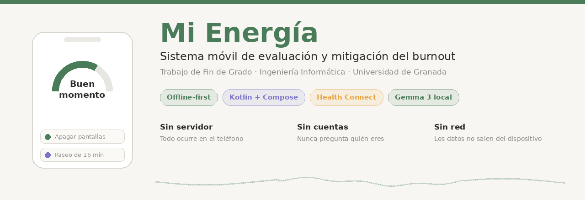

<p align="center">
  
</p>

<p align="center">
  
  
  
  
  
</p>

---

**Tu Propio Ritmo** es una aplicación Android que ayuda a detectar a tiempo el síndrome de quemarse por el trabajo (burnout) y a mitigarlo. Cruza lo que la persona *siente*, mediante un cuestionario psicométrico, con lo que su *cuerpo registra* durante la noche —sueño, pulso en reposo y variabilidad cardíaca— y traduce ambas cosas en una lectura comprensible y en pautas concretas.

Todo el procesamiento sucede dentro del teléfono. No hay servidor, no hay cuentas de usuario y la aplicación no realiza ninguna llamada de red. Los datos de salud nunca salen del dispositivo.

Trabajo de Fin de Grado del Grado en Ingeniería Informática de la Universidad de Granada, tutorizado por Zoraida Callejas Carrión.

## Índice

- [Qué hace](#qué-hace)
- [Cómo instalarlo en tu móvil](#cómo-instalarlo-en-tu-móvil)
- [Cómo funciona por dentro](#cómo-funciona-por-dentro)
- [Compilar desde el código](#compilar-desde-el-código)
- [Estructura del proyecto](#estructura-del-proyecto)
- [Pruebas](#pruebas)
- [Privacidad y límites](#privacidad-y-límites)
- [Licencia](#licencia)

## Qué hace

**Evalúa una vez al mes.** Un asistente conversacional administra un cuestionario de veinte ítems estructurado según el modelo CESQT de Gil-Monte, que mide cuatro dimensiones: desgaste psíquico, indolencia, ilusión por el trabajo y culpa. No es un formulario: el asistente introduce la escala, acusa recibo entre bloques y permite retomar la evaluación donde se dejó si la aplicación se cierra a mitad.

**Observa cada noche sin que hagas nada.** Si tienes un reloj o anillo inteligente vinculado a Health Connect, la aplicación lee cada madrugada tu tiempo de sueño, tu frecuencia cardíaca en reposo y tu variabilidad. Solo de la ventana nocturna, porque durante el día la medida óptica no es fiable.

**Compara contigo mismo, no con una población.** Lo que importa no es dormir siete horas o tener cincuenta pulsaciones, sino apartarse de lo que resulta habitual *en ti*. El sistema construye tu línea base sobre cuatro semanas y contrasta con ella tu última semana.

**Te dice cómo estás sin darte un número.** El índice interno nunca se muestra. En su lugar verás una banda con lenguaje llano —«Buen momento», «Vas haciendo camino», «Hoy toca cuidarse»— porque enseñar una puntuación baja a quien ya se siente mal solo refuerza el malestar.

**Propone pautas que encajan con lo que te pasa.** El catálogo tiene veinticuatro actividades repartidas en higiene del sueño, atención plena, reestructuración cognitiva y apoyo social. El sistema prioriza la categoría que corresponde al componente más deteriorado y no repite una pauta hasta pasadas tres semanas. Tú eliges cuáles aceptas.

**Sabe cuándo callarse y derivar.** Si la dimensión de culpa cruza su umbral, el sistema deja de proponer consejos. Sugerir «date un paseo» a alguien en esa situación sería trivializar lo que le ocurre. En su lugar ofrece el teléfono de la línea 024, disponible las veinticuatro horas, y el contacto del colegio profesional de tu provincia.

**Responde preguntas sin inventarse nada.** Un segundo asistente resuelve dudas sobre el burnout, sobre las actividades o sobre la propia aplicación, recuperando fragmentos de una base documental local y reformulándolos con un modelo de lenguaje que corre en el teléfono. Si no encuentra material fiable, lo dice. No diagnostica bajo ninguna circunstancia.

## Cómo instalarlo en tu móvil

> **Aviso.** Esto es un prototipo académico, no un producto. No ha pasado validación clínica ni auditoría de seguridad. Úsalo con esa idea en mente.

### Necesitas

- Un móvil Android 9 o superior
- **Google Health Connect**: viene integrado a partir de Android 14; en versiones anteriores se instala desde Play Store
- Opcionalmente, un reloj o pulsera con su aplicación de fabricante (Zepp, Fitbit, Garmin, Samsung Health, Mi Fitness…). Sin él la aplicación funciona igual, solo que sin la parte biométrica

### Instalación

Instalas un único archivo `.apk` y ya está. **Todo viene dentro**, incluido el modelo de inteligencia artificial: no hay descargas posteriores, ni configuración inicial, ni cuentas que crear. En el primer arranque la aplicación coloca el modelo en su almacenamiento privado y lo deja activo por defecto.

Este repositorio contiene el código fuente, no el instalable. Para obtener el `.apk` tienes dos vías: que alguien te lo pase ya compilado, o compilarlo tú siguiendo las instrucciones de [Compilar desde el código](#compilar-desde-el-código).

Con el archivo en la mano, cópialo al móvil, ábrelo desde el explorador de archivos y acepta el aviso de «instalar aplicaciones de origen desconocido». Es normal: Android lo muestra con cualquier aplicación que no venga de Play Store.

El instalable ronda los 300 MB, casi todo modelo. Es el precio de que la aplicación funcione sin conexión y sin enviar nada a ningún servidor.

### Primeros pasos

1. **Consentimiento.** Al abrir por primera vez verás qué se mide y dónde se guarda. Hasta aceptarlo, la aplicación no recoge nada.
2. **Tres preguntas.** Sobre tu carga de trabajo, tu margen de decisión y el apoyo que tienes. Sirven para ajustar las recomendaciones, no para evaluarte.
3. **Primera evaluación.** El asistente te la propone directamente. Son unos minutos.
4. **Vincular el reloj (opcional).** En la pestaña Dispositivos, pulsa «Conectar y actualizar datos» y concede los permisos. Puedes hacerlo entonces o más adelante.

### Para que lleguen los datos del reloj

La aplicación no habla con tu reloj: lee de Health Connect. La cadena completa es **reloj → app del fabricante → Health Connect → Tu Propio Ritmo**, y basta con que un eslabón falle para que no llegue nada.

Si la pantalla de Dispositivos muestra el semáforo en ámbar o gris:

- Abre la aplicación del fabricante y deja que sincronice
- Comprueba en los ajustes de esa aplicación que tiene permiso para **escribir** en Health Connect
- Verifica que Health Connect está instalado y actualizado
- Vuelve a Tu Propio Ritmo y pulsa «Conectar y actualizar datos»

Ten en cuenta que la línea base necesita **al menos tres días** de registros antes de calcular desviación alguna. Hasta entonces el sistema opera solo con el cuestionario, que es el comportamiento correcto: prefiere abstenerse antes que construir una referencia poco fiable.

## Cómo funciona por dentro

### El índice de riesgo

Cuatro términos ponderados, todos normalizados al intervalo entre cero y uno:

```
R = 0,40 · CESQT  +  0,30 · ΔSueño  +  0,20 · ΔVariabilidad  +  0,10 · ΔPulso
```

El cuestionario pesa más porque el burnout es un constructo psicológico y ningún sensor mide el cinismo o la culpa. Entre los componentes biométricos, el sueño domina porque la literatura lo señala como el más discriminativo.

Las tres desviaciones se calculan contra la línea base individual, no contra valores de población. Se consideran desviación máxima una caída del 50 % en la variabilidad, un déficit del 30 % en el sueño y una elevación de 10 latidos en el pulso en reposo.

Si falta alguna rama biométrica, su peso se redistribuye entre las disponibles en lugar de asignarle un valor neutro. El índice sigue siendo interpretable, aunque con menos resolución.

Los pesos y los umbrales son una propuesta razonada a partir de la literatura, **no están calibrados empíricamente**. Su validación requeriría un estudio longitudinal.

### Los dos asistentes

Administrar un cuestionario y resolver una duda abierta exigen garantías opuestas, así que se separan:

| | Asistente de evaluación | Asistente documental |
|---|---|---|
| **Cuándo** | Toca reevaluación y aceptas | El resto del tiempo |
| **Cómo** | Guion determinista, sin modelo | Recuperación documental + modelo local |
| **Por qué** | Los enunciados no admiten variación | Necesita interpretar preguntas abiertas |

### El recorrido de un mensaje

Cada consulta al asistente documental atraviesa seis fases en orden. Si una falla, el modelo de lenguaje ni siquiera llega a intervenir:

1. **Filtro de crisis** — expresiones de malestar intenso activan la derivación con texto fijo y validado
2. **Filtro de manipulación** — intentos de que abandone su papel o de arrancarle un diagnóstico
3. **Recuperación léxica** — TF-IDF sobre el corpus local, con las etiquetas ponderadas al doble
4. **Filtro de pertinencia** — descarta coincidencias casuales, como las que provocan los nombres de instituciones
5. **Redacción** — el modelo reformula *solo* el material recuperado
6. **Validación de salida** — rechaza si añade contenido, si mete terminología clínica, si inventa enlaces o si no reformula nada

Cuando la validación falla o el modelo no está disponible, se muestra el fragmento documental íntegro. El usuario siempre recibe un mensaje seguro, y esa garantía no depende de que el modelo se comporte bien.

### Los dos ritmos

El índice se recalcula **cada cuatro semanas** sobre una media móvil: es una fotografía de fondo que no debe alterarse por una mala noche. En paralelo, unas preguntas breves al final de la jornada permiten ofrecer algo puntual cuando el día ha sido duro, sin tocar la valoración general.

## Compilar desde el código

### Requisitos

- Android Studio Ladybug o posterior
- JDK 17
- SDK de Android 35

### Pasos

```bash
git clone https://github.com/Darioortegaleyva/TFG-BurnoutApp.git
cd TFG-BurnoutApp
```

Abre la carpeta desde Android Studio y espera a que Gradle sincronice.

### Añadir el modelo de lenguaje

> Este paso es **solo para quien compila**. Quien instala el `.apk` no tiene que hacer nada: el modelo ya viaja dentro.

El binario del modelo no está versionado en este repositorio, por dos motivos: ocupa unos 237 MB, tamaño que desaconseja su versionado, y su licencia exige aceptación individual por parte de quien lo descarga. Para que la compilación lo incorpore:

1. Entra en [Hugging Face — LiteRT Community](https://huggingface.co/litert-community) y busca `Gemma3-270M-IT` en formato `.task` con cuantización a 4 bits
2. Acepta los términos de licencia de Gemma
3. Renombra el archivo a `modelo_local.task`
4. Colócalo en `app/src/main/assets/`

A partir de ahí, cualquier `.apk` que generes lo llevará incluido y el usuario final lo recibirá integrado.

Si compilas **sin** colocarlo, la aplicación funciona igual: el asistente muestra el texto documental sin reformular, que es su comportamiento de respaldo, y ofrece importar un modelo manualmente desde la pantalla de Dispositivos. La reformulación es una mejora de presentación, no un requisito.

### Generar el APK

```bash
./gradlew assembleDebug
```

El archivo aparece en `app/build/outputs/apk/debug/`.

Para una compilación de distribución, `./gradlew assembleRelease` requiere configurar tu propia clave de firma. Los materiales de firma tampoco están versionados.

### Probar sin reloj

La compilación de depuración incluye un generador de datos biométricos sintéticos, accesible desde la pantalla de Dispositivos. Permite crear una semana de registros verosímiles para probar el motor completo sin hardware. **Estas herramientas no existen en la compilación de distribución**, ni los permisos de escritura que necesitan.

## Estructura del proyecto

```
app/src/main/java/com/tfg/burnout/
├── data/
│   ├── healthconnect/   Lectura de Health Connect y preferencias de fuentes
│   ├── ia/              Carga del modelo y reformulación local
│   ├── local/           Room: entidades, DAOs, cifrado, precarga de colegios
│   ├── rag/             Corpus documental y recuperador léxico
│   └── repository/      Punto único de acceso a datos
├── domain/
│   ├── cesqt/           Ítems, cálculo de puntuaciones, borrador persistente
│   ├── chat/            Filtros de crisis y manipulación, frases de apertura
│   ├── engine/          Motor de riesgo, catálogo, umbrales, validador
│   └── model/           Modelos de dominio
├── ui/                  Pantallas Compose y ViewModels
└── work/                Tareas programadas con WorkManager
```

Arquitectura MVVM en tres capas. El dominio no conoce Android; la capa de datos no conoce la interfaz.

| Componente | Dónde está |
|---|---|
| Cálculo del índice | `domain/engine/MotorRiesgo.kt` |
| Umbrales y constantes | `domain/engine/UmbralesRiesgo.kt` |
| Selección de pautas | `domain/engine/GestorCoping.kt` |
| Derivación profesional | `domain/engine/ModuloEticoRuteo.kt` |
| Recuperación documental | `data/rag/BuscadorRag.kt` |
| Validación de la salida del modelo | `domain/engine/ValidadorSalida.kt` |
| Cifrado de la base de datos | `data/local/security/GestorClaveBd.kt` |

## Pruebas

```bash
./gradlew test
```

65 pruebas unitarias en 14 suites, que cubren el cálculo del índice y sus umbrales, la clasificación en escenarios, la selección de pautas sin repetición, los tres filtros del asistente, el validador de salida y el recuperador documental.

## Privacidad y límites

**Qué se guarda:** tu consentimiento, el contexto laboral, las líneas base biométricas, el histórico de evaluaciones, los registros diarios y los retos que has elegido.

**Qué no se guarda:** tu nombre, tu correo, tu ubicación, ningún identificador y **tampoco la conversación con el asistente**. Los mensajes viven en memoria mientras la pantalla está abierta y desaparecen al cerrarla.

La base de datos se cifra con SQLCipher (AES-256) y la clave se custodia en el Android Keystore, de modo que nunca reside en claro. Las copias de seguridad del sistema están deshabilitadas. La aplicación no declara permiso de internet.

### Lo que esta aplicación no es

No es un producto sanitario ni emite diagnósticos. No sustituye a un profesional de la salud mental. **No debe desplegarla un empleador para vigilar a su plantilla**: es una herramienta personal y voluntaria, para uso y beneficio de quien la instala.

Los veinte enunciados del cuestionario son de redacción propia, inspirados en los constructos públicos del CESQT. **No son los ítems oficiales**, que están protegidos por derechos de autor y requieren licencia. La aplicación se lo advierte al usuario antes de comenzar. La estructura, el cálculo y la interpretación sí siguen el instrumento real, de modo que sustituirlos por los oficiales sería inmediato.

Si estás pasando por un momento difícil, en España tienes disponible el **teléfono 024**, gratuito y activo las veinticuatro horas.

## Licencia

Código publicado con fines académicos. El modelo Gemma 3 se rige por sus propios [términos de uso](https://ai.google.dev/gemma/terms).

---

<p align="center">
  Darío Ortega Leyva · Universidad de Granada · 2026
</p>
